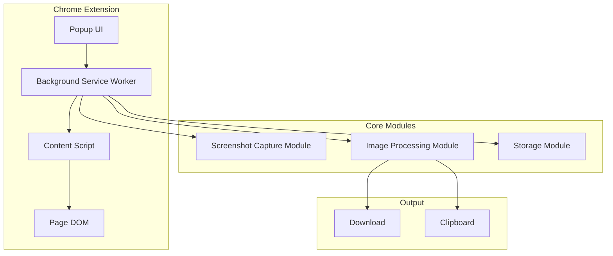
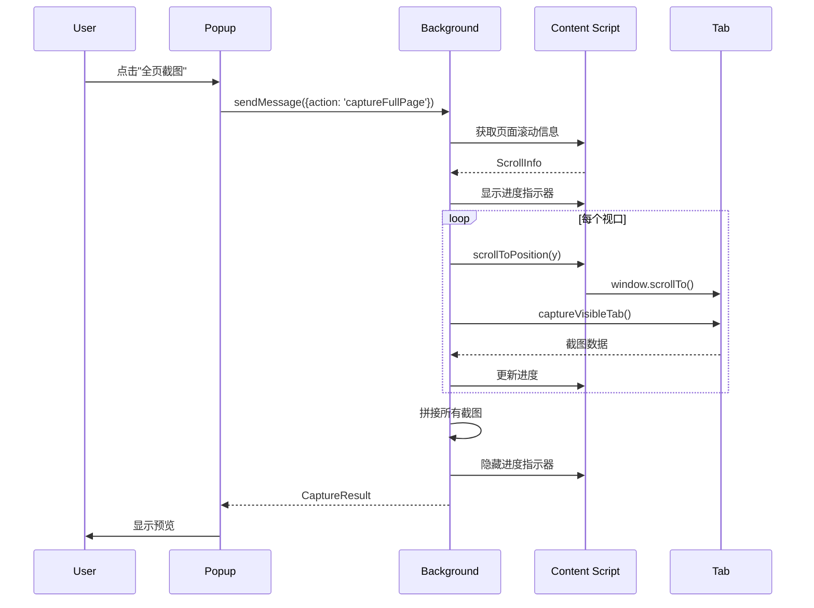

# Design Document

## Overview

Scroll Capture Extension 是一个 Chrome 浏览器扩展，提供三种截图模式：全页滚动截图、可视区域截图和选区截图。扩展采用 Manifest V3 规范开发，使用 Chrome Extension APIs 实现核心功能。

## Architecture



### 架构说明

- **Popup UI**: 用户交互界面，显示截图选项菜单
- **Background Service Worker**: 后台服务，协调各模块工作
- **Content Script**: 注入页面的脚本，处理页面滚动和选区操作
- **Screenshot Capture Module**: 使用 `chrome.tabs.captureVisibleTab` API 捕获屏幕
- **Image Processing Module**: 拼接多张截图，处理图片格式转换
- **Storage Module**: 管理用户设置和临时数据

## Components and Interfaces

### 1. Manifest 配置 (manifest.json)

```json
{
  "manifest_version": 3,
  "name": "Scroll Capture",
  "version": "1.0.0",
  "description": "Easy scroll screenshot capture for Chrome",
  "permissions": [
    "activeTab",
    "scripting",
    "storage",
    "downloads",
    "clipboardWrite"
  ],
  "action": {
    "default_popup": "popup.html",
    "default_icon": {
      "16": "icons/icon16.png",
      "48": "icons/icon48.png",
      "128": "icons/icon128.png"
    }
  },
  "background": {
    "service_worker": "background.js"
  },
  "commands": {
    "capture-full-page": {
      "suggested_key": { "default": "Alt+Shift+S" },
      "description": "Capture full page screenshot"
    },
    "capture-visible": {
      "suggested_key": { "default": "Alt+Shift+V" },
      "description": "Capture visible area"
    },
    "capture-selection": {
      "suggested_key": { "default": "Alt+Shift+A" },
      "description": "Capture selected area"
    }
  },
  "icons": {
    "16": "icons/icon16.png",
    "48": "icons/icon48.png",
    "128": "icons/icon128.png"
  }
}
```

### 2. Background Service Worker (background.js)

```typescript
interface CaptureOptions {
  mode: 'full' | 'visible' | 'selection';
  format: 'png' | 'jpeg';
  quality?: number; // 0-100 for JPEG
}

interface CaptureResult {
  success: boolean;
  dataUrl?: string;
  error?: string;
  dimensions?: { width: number; height: number };
}

// 主要方法
async function captureVisibleArea(): Promise<CaptureResult>
async function captureFullPage(tabId: number): Promise<CaptureResult>
async function captureSelection(tabId: number, rect: SelectionRect): Promise<CaptureResult>
async function downloadImage(dataUrl: string, filename: string): Promise<void>
async function copyToClipboard(dataUrl: string): Promise<void>
```

### 3. Content Script (content.js)

```typescript
interface SelectionRect {
  x: number;
  y: number;
  width: number;
  height: number;
}

interface ScrollInfo {
  scrollHeight: number;
  scrollWidth: number;
  viewportHeight: number;
  viewportWidth: number;
  currentScrollY: number;
}

// 主要方法
function getScrollInfo(): ScrollInfo
async function scrollToPosition(y: number): Promise<void>
function createSelectionOverlay(): HTMLElement
function getSelectionRect(): SelectionRect
function showProgressIndicator(percent: number): void
function hideProgressIndicator(): void
```

### 4. Popup UI (popup.html/popup.js)

```typescript
interface UIState {
  language: 'zh' | 'en';
  isCapturing: boolean;
  previewDataUrl: string | null;
}

// UI 组件
- CaptureButton: 截图按钮组件
- PreviewPanel: 预览面板组件
- ProgressBar: 进度条组件
- FormatSelector: 格式选择器
- LanguageToggle: 语言切换
```

## Data Models

### 用户设置模型

```typescript
interface UserSettings {
  defaultFormat: 'png' | 'jpeg';
  jpegQuality: number; // 默认 92
  language: 'zh' | 'en';
  showGuideOnInstall: boolean;
  shortcuts: {
    fullPage: string;
    visible: string;
    selection: string;
  };
}

// 默认设置
const DEFAULT_SETTINGS: UserSettings = {
  defaultFormat: 'png',
  jpegQuality: 92,
  language: 'zh',
  showGuideOnInstall: true,
  shortcuts: {
    fullPage: 'Alt+Shift+S',
    visible: 'Alt+Shift+V',
    selection: 'Alt+Shift+A'
  }
};
```

### 截图任务模型

```typescript
interface CaptureTask {
  id: string;
  mode: 'full' | 'visible' | 'selection';
  status: 'pending' | 'capturing' | 'processing' | 'completed' | 'failed';
  progress: number; // 0-100
  startTime: number;
  endTime?: number;
  result?: CaptureResult;
}
```

## 全页截图流程



## Error Handling

| 错误场景 | 处理方式 |
|---------|---------|
| 页面无法截图（如 chrome:// 页面） | 显示友好提示："此页面不支持截图" |
| 截图过程中页面关闭 | 取消任务，清理临时数据 |
| 内存不足（超长页面） | 分段保存，提示用户页面过长 |
| 剪贴板写入失败 | 提示用户手动保存图片 |
| 下载失败 | 显示错误信息，提供重试选项 |

### 错误处理代码示例

```typescript
async function safeCaptureFullPage(tabId: number): Promise<CaptureResult> {
  try {
    const tab = await chrome.tabs.get(tabId);
    
    // 检查是否为受限页面
    if (tab.url?.startsWith('chrome://') || tab.url?.startsWith('chrome-extension://')) {
      return { success: false, error: 'RESTRICTED_PAGE' };
    }
    
    return await captureFullPage(tabId);
  } catch (error) {
    console.error('Capture failed:', error);
    return { success: false, error: error.message };
  }
}
```

## Testing Strategy

### 单元测试

- 图片拼接算法测试
- 文件名生成格式测试
- 设置存储/读取测试

### 集成测试

- Popup 与 Background 通信测试
- Content Script 注入测试
- 快捷键触发测试

### 手动测试场景

| 测试场景 | 预期结果 |
|---------|---------|
| 普通网页全页截图 | 完整捕获所有内容 |
| 带固定头部的页面 | 正确处理 fixed 元素 |
| 无限滚动页面 | 截取当前已加载内容 |
| 横向滚动页面 | 正确捕获横向内容 |
| 选区跨越滚动区域 | 正确拼接选区内容 |

## 文件结构

```
scroll-capture-extension/
├── manifest.json
├── background.js
├── content.js
├── popup/
│   ├── popup.html
│   ├── popup.js
│   └── popup.css
├── icons/
│   ├── icon16.png
│   ├── icon48.png
│   └── icon128.png
├── utils/
│   ├── image-processor.js
│   └── i18n.js
└── _locales/
    ├── en/
    │   └── messages.json
    └── zh_CN/
        └── messages.json
```
